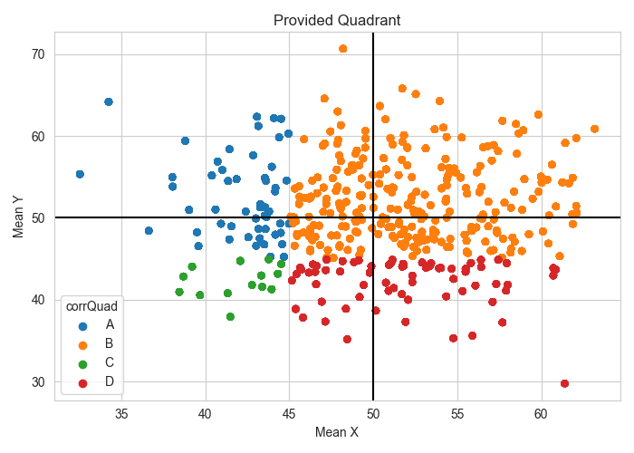

## Introduction
* Context and background information
* Study objectives
* Experiment design
* Other details

## Proposed Methods
For analysis of the visualization data, the response variable will be a binary categorical value (0/1) indicating if the quadrant was correctly identified by the subject.  The remaining variables summarized below will be used in a Generalized Linear Mixed Model (GLMM) with the assumption that the response follows a binomial distribution.

| Variable Name | Type (continuous/categorical)                           | Effect Type   |
| ------------- | ------------------------------------------------------- | ------------- |
| currImg       | Categorical - binary                                    | Random Effect |
| subj          | Categorical - unique to each subject i.e. has 52 levels | Random Effect |
| distToMiddle  | Continuous                                              | Fixed Effect  |
| meanSD        | Continuous                                              | Fixed Effect  |
| isColSame     | Categorical - binary                                    | Fixed Effect  |
| isSizeSame    | Categorical - binary                                    | Fixed Effect  |
| howManyCorr   | Categorical - (0, 1, 2, 3)                              | Fixed Effect  |

Because the x and y pairs of the individual points which consisted of the images shown to the subject were also provided, additional features may be calculated and examined. Two examples may be: the number of points in the correct quadrant, and the distance to the closest boundary

Assumptions for logistic regression models are difficult to check, however some key checks that can and will be done are:

* Normality of the estimates of the random effects via QQ-plots
* Proportions of correct answers for binned values of continuous variables (as shown below) show trends similar to modeled values

Because there are no specific variables of interest to test the effect of, model selection will be used to address the use of overly complex models to enhance interpretability while prioritizing the ability of the model to describe the response. A 5-fold cross validation is proposed to identify the model (or set of variables) with the best average accuracy on the test folds. If a large imbalance is found in the data, adjustments will be made to the metric to account for this.

The following results will be reported as final deliverables:

* Interpretation of the model coefficients and what their implications on the ability for subjects to identify correct quadrants
* Estimated probability of subjects correctly identifying the quadrant by image - focus on lowest and highest 5th percentiles

## Summary Statistics and Exploratory Analysis
* Counts of true quadrants (show large number in quadrant B)
* Box plots for subject accuracy

Below is a plot demonstrating how the centroid for many of the images was identified as belonging to Quadrant B resulting in a large imbalance and need for potential correction.

Below are some plots of numerical variables which have been binned for the continuous cases to illustrate how the proportion correct may change over different values of each variable. 

