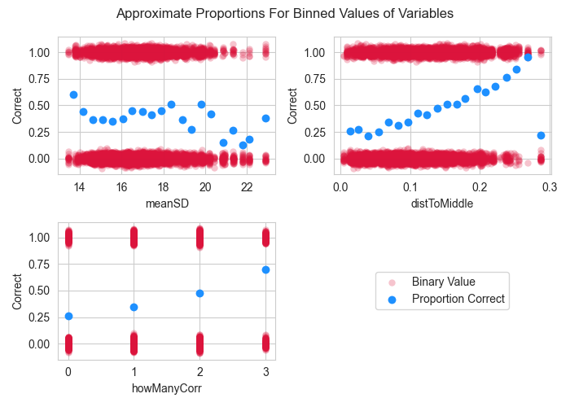

# STAA 556: Visual Project Proposal

#### Team Members
- [Rodney Murray](mailto:Rodney.Murray@colostate.edu)
- [Brendon Stanley](mailto:Brendon.Stanley@rams.colostate.edu)

## Introduction

    Hurricane Ian swept through the Hurricane Belt in 2022 leaving behind 149 deaths in Florida
and an estimated $113 Billion USD in damages (Florida Department of Law Enforcement; National Centers for Environmental Information).
Concerns were raised regarding the readability of the hurricane forecast maps and the "cone" that is used to show the predicted path path of the hurricane (Dance and Ajasa).
News outlets have suggested that the cone is misleading and that the public may not understand the information presented (Pulver and Doyle).
This project aims to provide background to better understand how vision works and how to produce informative data visualizations.
The project will be a stepping stone for continued research of data visualization and how to communicate hurricane forecast data effectively.

    Data for this project was collected in an experiment of 52 subjects enrolled in psychology 100 at CSU. Subjects were shown an image of dots via an online survey (see figure one) and 
asked to select the quadrant where the centroid of the dots was located (see figure two); i.e., where is the middle of the dots? Each image was shown for less than one second and the 
subject was asked to select which quadrant the centroid of the dots was in. The subjects' response was recorded along with metadata about the image. Each subject was 
randomly shown 200 images from a pool of 400 images. For each image there were 90 dots total with 30 red dots, 30 big dots, and 30 dots with black outlines.

  Figure 1: Experiment Visual Stimulus Example

  Figure 2: Experiment Centroid Quadrant Options

## Proposed Methods
For analysis of the visualization data, the response variable will be a binary categorical value (0/1) indicating if the quadrant was correctly identified by the subject.  The remaining variables summarized below will be used in a Generalized Linear Mixed Model (GLMM) with the assumption that the response follows a binomial distribution.

| Variable Name | Type (continuous/categorical)                           | Effect Type      |
| ------------- | ------------------------------------------------------- | ---------------- |
| currImg       | Categorical - binary                                    | Random Intercept |
| subj          | Categorical - unique to each subject i.e. has 52 levels | Random Intercept |
| distToMiddle  | Continuous                                              | Fixed Effect     |
| meanSD        | Continuous                                              | Fixed Effect     |
| isColSame     | Categorical - binary                                    | Fixed Effect     |
| isSizeSame    | Categorical - binary                                    | Fixed Effect     |
| howManyCorr   | Categorical - (0, 1, 2, 3)                              | Fixed Effect     |

Because the x and y pairs of the individual points which consisted of the images shown to the subject were also provided, additional features may be calculated and examined. Two examples may be: the number of points in the correct quadrant, and the distance to the closest boundary

Assumptions for logistic regression models are difficult to check, however some key checks that can and will be done are:

* Normality of the estimates of the random effects via QQ-plots
* Proportions of correct answers for binned values of continuous variables (as shown below) show trends similar to modeled values

Because there are no specific variables of interest to test the effect of, model selection will be used to avoid overly complex models to enhance interpretability while prioritizing the ability of the model to describe the response. 5-fold cross validation is proposed to identify the model (i.e. set of variables) with the best average accuracy on the test folds. If a large imbalance is found in the data, adjustments will be made to the metric to account for this.

The following results will be reported as final deliverables:

* Interpretation of the model coefficients and what their implications on the ability for subjects to identify correct quadrants
* Estimated probability of subjects correctly identifying the quadrant by image - focus on lowest and highest 5th percentiles to provide focus for further studies.

## Summary Statistics and Exploratory Analysis

    Figure three shows the total number of times each quadrant appeared, and the
total number of times each quadrant was selected by the subjects. Quadrant `B` appeared
almost twice as often as the other quadrants combined biasing the data in favor of
quadrant `B`.

    Looking at figure four, the accuracy for how often the subjects selected the correct
is shown. This is presented as the overall percentage of correct selections across all
subjects based on factors such as `isColSame`, `isPulseSame`, and `isSizeSame`, and `howManyCorr`.
Of the special factors, `isColSame`, `isPulseSame` and, `isSizeSame` the largest impact was `isPulseSame`.
Not only did this improve the median accuracy but also appears to reduce variability.

    However, the larger question is what happens when multiple factors are combined. The `howManyCorr` factor shows that 
the more factors that are simultaneously true the higher the accuracy. There may be a potential interaction between 
the variables `isColSame`, `isPulseSame` and, `isSizeSame`. When `howManyCorr` is 3 the accuracy improves dramatically 
but so does the variability. Model selection will need to investigate this further.

  Figure 3: Quadrant Counts

  Figure 4: Subject Accuracy

Figure five demonstrates how the centroid for many of the images was identified as belonging to Quadrant B resulting in a large imbalance and need for potential correction.

  Figure 5: Provided Quadrants

Figure six shows averages of binned values for numerical variables demonstrate how the proportion of correct responses may change for different values of that numerical variable. 

  Figure 6: Approximate Proportions

## References

Dance, Scott and Amudalat, Ajasa. "Cone of Confusion: Why Some Say Iconic Hurricane Map Misled Floridians, www.washingtonpost.com/climate-environment/2022/10/04/hurricane-cone-map-confusion/. Accessed 22 May 2024.

Florida Department of Law Enforcement. "Update: Florida Medical Examiners Commission Hurricane Ian Deaths." FDLE, February 2023, www.fdle.state.fl.us/News/2023/February/Update-Florida-Medical-Examiners-Commission-Hurric.

National Centers for Environmental Information (NCEI). "Billion-Dollar Weather and Climate Disasters." NOAA, 2022, www.ncei.noaa.gov/access/billions/events/US/2022?disasters%5B%5D=tropical-cyclone.

Pulver, Voyles, and Doyle, Rice. “Many People Misunderstand This Famous Hurricane Forecast Graphic. It Can Be a Deadly Mistake.” USA Today, Gannett Satellite Information Network, 20 Oct. 2022, www.usatoday.com/story/news/2022/10/19/hurricane-ian-new-criticism-for-the-cone-of-uncertainty/10529838002/. 
